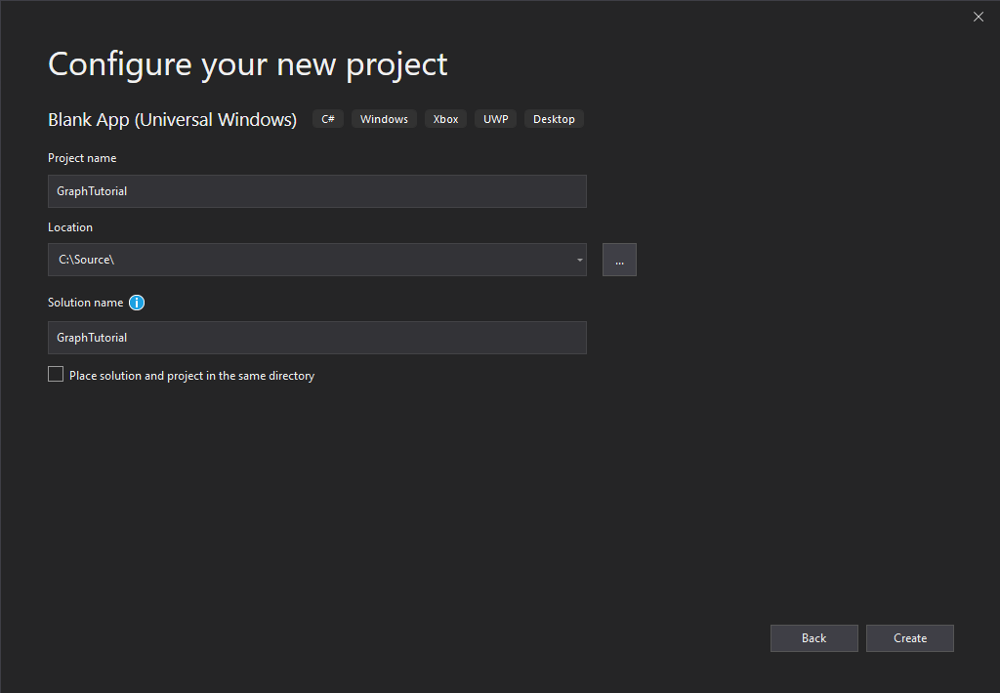

<!-- markdownlint-disable MD002 MD041 -->

В этом разделе вы создадите новое приложение UWP.

1. Откройте Visual Studio и выберите **создать новый проект**. Выберите параметр **пустое приложение (универсальные окна)** , в котором используется C#, а затем нажмите кнопку **Далее**.

    

1. В диалоговом окне **Настройка нового проекта** введите `GraphTutorial` в поле **Название проекта** и нажмите кнопку **создать**.

    

    > [!IMPORTANT]
    > Убедитесь, что вы вводите точно такое же имя для проекта Visual Studio, которое указано в этих инструкциях лаборатории. Имя проекта Visual Studio становится частью пространства имен в коде. Код в этих инструкциях зависит от пространства имен, которое соответствует имени проекта Visual Studio, указанного в данных инструкциях. Если вы используете другое имя проекта, код не будет компилироваться, если не настроить все пространства имен в качестве имени проекта Visual Studio, вводимого при создании проекта.

1. Нажмите кнопку **ОК**. В диалоговом окне **новый универсальный проект платформы Windows** убедитесь, что для `Windows 10, Version 1809 (10.0; Build 17763)` **минимальной версии** задано значение, или более поздней, а затем нажмите кнопку **ОК**.

## <a name="install-nuget-packages"></a>Установка пакетов Nuget

Прежде чем переходить, установите некоторые дополнительные пакеты NuGet, которые будут использоваться позже.

- [Microsoft. Toolkit. UWP. UI. Controls](https://www.nuget.org/packages/Microsoft.Toolkit.Uwp.Ui.Controls/) для добавления элементов управления пользовательского интерфейса для уведомлений в приложении и загрузки индикаторов.
- [Microsoft. Toolkit. UWP. UI. Controls. DataGrid](https://www.nuget.org/packages/Microsoft.Toolkit.Uwp.Ui.Controls.DataGrid/) для отображения сведений, возвращенных Microsoft Graph.
- [Microsoft. Toolkit. Graph. Controls](https://www.nuget.org/packages/Microsoft.Toolkit.Graph.Controls) для обработки извлечения маркера входа и доступа.

1. Выберите **инструменты > диспетчер пакетов NuGet > консоли диспетчера пакетов**. В консоли диспетчера пакетов введите указанные ниже команды.

    ```powershell
    Install-Package Microsoft.Toolkit.Uwp.Ui.Controls -Version 6.0.0
    Install-Package Microsoft.Toolkit.Uwp.Ui.Controls.DataGrid -Version 6.0.0
    Install-Package Microsoft.Toolkit.Graph.Controls -IncludePrerelease
    ```

## <a name="design-the-app"></a>Проектирование приложения

В этом разделе описывается создание пользовательского интерфейса для приложения.

1. Для начала добавьте переменную уровня приложения для отслеживания состояния проверки подлинности. В обозревателе решений разверните узел **app. XAML** и откройте **app.XAML.CS**. Добавьте в `App` класс следующее свойство.

    ```csharp
    public bool IsAuthenticated { get; set; }
    ```

1. Определите макет главной страницы. Откройте `MainPage.xaml` и замените все содержимое приведенным ниже.

    :::code language="xaml" source="../demo/GraphTutorial/MainPage.xaml" id="MainPageXamlSnippet":::

    Этот параметр определяет базовую [навигатионвиев](/uwp/api/windows.ui.xaml.controls.navigationview) с **домашними** и **календарными** ссылками навигации, которые действуют в качестве основного представления приложения. Кроме того, в заголовок представления добавляется элемент управления [логинбуттон](https://github.com/windows-toolkit/Graph-Controls) . Этот элемент управления позволит пользователю выполнить вход и выход. Элемент управления еще не полностью включен, его можно настроить в ходе следующего упражнения.

1. Щелкните правой кнопкой мыши проект **Graph – Tutorial** в обозревателе решений и выберите команду **Добавить > новый элемент..**.. Выберите **пустая страница**, `HomePage.xaml` введите в поле **имя** и нажмите кнопку **Добавить**. Замените существующий `<Grid>` элемент в файле на следующий.

    :::code language="xaml" source="../demo/GraphTutorial/HomePage.xaml" id="HomePageGridSnippet" highlight="2-5":::

1. Разверните узел **MainPage. XAML** в обозревателе решений и `MainPage.xaml.cs`откройте его. Добавьте указанную ниже функцию в `MainPage` класс для управления состоянием проверки подлинности.

    :::code language="csharp" source="../demo/GraphTutorial/MainPage.xaml.cs" id="SetAuthStateSnippet":::

1. Добавьте следующий код в `MainPage()` конструктор **после** `this.InitializeComponent();` строки.

    ```csharp
    // Initialize auth state to false
    SetAuthState(false);

    // Configure MSAL provider
    // TEMPORARY
    MsalProvider.ClientId = "11111111-1111-1111-1111-111111111111";

    // Navigate to HomePage.xaml
    RootFrame.Navigate(typeof(HomePage));
    ```

    При первом запуске приложения выполняется инициализация состояния проверки подлинности на `false` домашнюю страницу и переход на нее.

1. Добавьте следующий обработчик событий для загрузки запрашиваемой страницы, когда пользователь выбирает элемент в представлении навигации.

    ```csharp
    private void NavView_ItemInvoked(NavigationView sender, NavigationViewItemInvokedEventArgs args)
    {
        var invokedItem = args.InvokedItem as string;

        switch (invokedItem.ToLower())
        {
            case "calendar":
                throw new NotImplementedException();
                break;
            case "home":
            default:
                RootFrame.Navigate(typeof(HomePage));
                break;
        }
    }
    ```

1. Сохраните все изменения, нажмите клавишу **F5** или выберите **Отладка > начать отладку** в Visual Studio.

    > [!NOTE]
    > Убедитесь, что выбрана соответствующая конфигурация для вашего компьютера (ARM, x64, x86).

    
