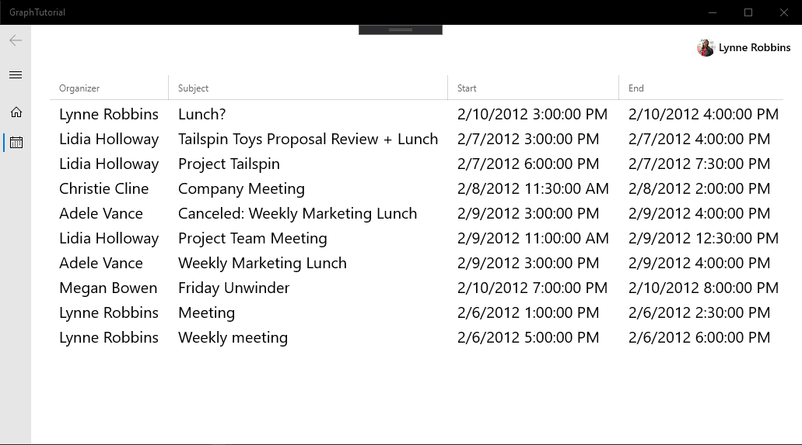

<!-- markdownlint-disable MD002 MD041 -->

<span data-ttu-id="a92ec-101">В этом упражнении вы добавите Microsoft Graph в приложение.</span><span class="sxs-lookup"><span data-stu-id="a92ec-101">In this exercise you will incorporate the Microsoft Graph into the application.</span></span> <span data-ttu-id="a92ec-102">Для этого приложения вы будете использовать [клиентскую библиотеку Microsoft Graph для .NET](https://github.com/microsoftgraph/msgraph-sdk-dotnet) , чтобы совершать вызовы в Microsoft Graph.</span><span class="sxs-lookup"><span data-stu-id="a92ec-102">For this application, you will use the [Microsoft Graph Client Library for .NET](https://github.com/microsoftgraph/msgraph-sdk-dotnet) to make calls to Microsoft Graph.</span></span>

## <a name="get-calendar-events-from-outlook"></a><span data-ttu-id="a92ec-103">Получение событий календаря из Outlook</span><span class="sxs-lookup"><span data-stu-id="a92ec-103">Get calendar events from Outlook</span></span>

1. <span data-ttu-id="a92ec-104">Добавление новой страницы для представления календаря.</span><span class="sxs-lookup"><span data-stu-id="a92ec-104">Add a new page for the calendar view.</span></span> <span data-ttu-id="a92ec-105">Щелкните правой кнопкой мыши проект **графтуториал** в обозревателе решений и выберите команду **Добавить > новый элемент..**.. Выберите **пустая страница**, `CalendarPage.xaml` введите в поле **имя** и нажмите кнопку **Добавить**.</span><span class="sxs-lookup"><span data-stu-id="a92ec-105">Right-click the **GraphTutorial** project in Solution Explorer and select **Add > New Item...**. Choose **Blank Page**, enter `CalendarPage.xaml` in the **Name** field, and select **Add**.</span></span>

1. <span data-ttu-id="a92ec-106">Откройте `CalendarPage.xaml` и добавьте указанную ниже строку в существующий `<Grid>` элемент.</span><span class="sxs-lookup"><span data-stu-id="a92ec-106">Open `CalendarPage.xaml` and add the following line inside the existing `<Grid>` element.</span></span>

    ```xaml
    <TextBlock x:Name="Events" TextWrapping="Wrap"/>
    ```

1. <span data-ttu-id="a92ec-107">Откройте `CalendarPage.xaml.cs` и добавьте приведенные `using` ниже операторы в начало файла.</span><span class="sxs-lookup"><span data-stu-id="a92ec-107">Open `CalendarPage.xaml.cs` and add the following `using` statements at the top of the file.</span></span>

    ```csharp
    using Microsoft.Toolkit.Graph.Providers;
    using Microsoft.Toolkit.Uwp.UI.Controls;
    using Newtonsoft.Json;
    ```

1. <span data-ttu-id="a92ec-108">Добавьте в `CalendarPage` класс следующие функции.</span><span class="sxs-lookup"><span data-stu-id="a92ec-108">Add the following functions to the `CalendarPage` class.</span></span>

    ```csharp
    private void ShowNotification(string message)
    {
        // Get the main page that contains the InAppNotification
        var mainPage = (Window.Current.Content as Frame).Content as MainPage;

        // Get the notification control
        var notification = mainPage.FindName("Notification") as InAppNotification;

        notification.Show(message);
    }

    protected override async void OnNavigatedTo(NavigationEventArgs e)
    {
        // Get the Graph client from the provider
        var graphClient = ProviderManager.Instance.GlobalProvider.Graph;

        try
        {
            // Get the events
            var events = await graphClient.Me.Events.Request()
                .Select("subject,organizer,start,end")
                .OrderBy("createdDateTime DESC")
                .GetAsync();

            // TEMPORARY: Show the results as JSON
            Events.Text = JsonConvert.SerializeObject(events.CurrentPage);
        }
        catch(Microsoft.Graph.ServiceException ex)
        {
            ShowNotification($"Exception getting events: {ex.Message}");
        }

        base.OnNavigatedTo(e);
    }
    ```

    <span data-ttu-id="a92ec-109">Рассмотрим выполнение кода `OnNavigatedTo` .</span><span class="sxs-lookup"><span data-stu-id="a92ec-109">Consider with the code in `OnNavigatedTo` is doing.</span></span>

    - <span data-ttu-id="a92ec-110">URL-адрес, который будет вызываться — это `/v1.0/me/events`.</span><span class="sxs-lookup"><span data-stu-id="a92ec-110">The URL that will be called is `/v1.0/me/events`.</span></span>
    - <span data-ttu-id="a92ec-111">`Select` Функция ограничит поля, возвращаемые для каждого события, только теми, которые будут реально использоваться в представлении.</span><span class="sxs-lookup"><span data-stu-id="a92ec-111">The `Select` function limits the fields returned for each events to just those the view will actually use.</span></span>
    - <span data-ttu-id="a92ec-112">`OrderBy` Функция сортирует результаты по дате и времени создания, начиная с самого последнего элемента.</span><span class="sxs-lookup"><span data-stu-id="a92ec-112">The `OrderBy` function sorts the results by the date and time they were created, with the most recent item being first.</span></span>

1. <span data-ttu-id="a92ec-113">Измените `NavView_ItemInvoked` метод в `MainPage.xaml.cs` файле, чтобы заменить существующий `switch` оператор на следующий.</span><span class="sxs-lookup"><span data-stu-id="a92ec-113">Modify the `NavView_ItemInvoked` method in the `MainPage.xaml.cs` file to replace the existing `switch` statement with the following.</span></span>

    :::code language="csharp" source="../demo/GraphTutorial/MainPage.xaml.cs" id="SwitchStatementSnippet" highlight="4":::

<span data-ttu-id="a92ec-114">Теперь можно запустить приложение, войти и щелкнуть элемент Навигация в **календаре** в меню слева.</span><span class="sxs-lookup"><span data-stu-id="a92ec-114">You can now run the app, sign in, and click the **Calendar** navigation item in the left-hand menu.</span></span> <span data-ttu-id="a92ec-115">Вы должны увидеть дамп событий в календаре пользователя.</span><span class="sxs-lookup"><span data-stu-id="a92ec-115">You should see a JSON dump of the events on the user's calendar.</span></span>

## <a name="display-the-results"></a><span data-ttu-id="a92ec-116">Отображение результатов</span><span class="sxs-lookup"><span data-stu-id="a92ec-116">Display the results</span></span>

1. <span data-ttu-id="a92ec-117">Замените все содержимое `CalendarPage.xaml` следующим.</span><span class="sxs-lookup"><span data-stu-id="a92ec-117">Replace the entire contents of `CalendarPage.xaml` with the following.</span></span>

    ```xaml
    <Page
        x:Class="GraphTutorial.CalendarPage"
        xmlns="http://schemas.microsoft.com/winfx/2006/xaml/presentation"
        xmlns:x="http://schemas.microsoft.com/winfx/2006/xaml"
        xmlns:local="using:GraphTutorial"
        xmlns:d="http://schemas.microsoft.com/expression/blend/2008"
        xmlns:mc="http://schemas.openxmlformats.org/markup-compatibility/2006"
        xmlns:controls="using:Microsoft.Toolkit.Uwp.UI.Controls"
        mc:Ignorable="d"
        Background="{ThemeResource ApplicationPageBackgroundThemeBrush}">

        <Grid>
            <controls:DataGrid x:Name="EventList" Grid.Row="1"
                    AutoGenerateColumns="False">
                <controls:DataGrid.Columns>
                    <controls:DataGridTextColumn
                            Header="Organizer"
                            Width="SizeToCells"
                            Binding="{Binding Organizer.EmailAddress.Name}"
                            FontSize="20" />
                    <controls:DataGridTextColumn
                            Header="Subject"
                            Width="SizeToCells"
                            Binding="{Binding Subject}"
                            FontSize="20" />
                    <controls:DataGridTextColumn
                            Header="Start"
                            Width="SizeToCells"
                            Binding="{Binding Start.DateTime}"
                            FontSize="20" />
                    <controls:DataGridTextColumn
                            Header="End"
                            Width="SizeToCells"
                            Binding="{Binding End.DateTime}"
                            FontSize="20" />
                </controls:DataGrid.Columns>
            </controls:DataGrid>
        </Grid>
    </Page>
    ```

1. <span data-ttu-id="a92ec-118">Откройте `CalendarPage.xaml.cs` и замените `Events.Text = JsonConvert.SerializeObject(events.CurrentPage);` строку следующим.</span><span class="sxs-lookup"><span data-stu-id="a92ec-118">Open `CalendarPage.xaml.cs` and replace the `Events.Text = JsonConvert.SerializeObject(events.CurrentPage);` line with the following.</span></span>

    ```csharp
    EventList.ItemsSource = events.CurrentPage.ToList();
    ```

    <span data-ttu-id="a92ec-119">Если вы запустите приложение сейчас и выбираете календарь, вам следует получить список событий в сетке данных.</span><span class="sxs-lookup"><span data-stu-id="a92ec-119">If you run the app now and select the calendar, you should get a list of events in a data grid.</span></span> <span data-ttu-id="a92ec-120">Тем не менее, **Начальное** и **Конечное** значения отображаются непонятным способом.</span><span class="sxs-lookup"><span data-stu-id="a92ec-120">However, the **Start** and **End** values are displayed in a non-user-friendly manner.</span></span> <span data-ttu-id="a92ec-121">Способ отображения этих значений можно контролировать с помощью [конвертера значений](https://docs.microsoft.com/uwp/api/Windows.UI.Xaml.Data.IValueConverter).</span><span class="sxs-lookup"><span data-stu-id="a92ec-121">You can control how those values are displayed by using a [value converter](https://docs.microsoft.com/uwp/api/Windows.UI.Xaml.Data.IValueConverter).</span></span>

1. <span data-ttu-id="a92ec-122">Щелкните правой кнопкой мыши проект **графтуториал** в обозревателе решений и выберите команду **Добавить класс >..**.. Назовите класс `GraphDateTimeTimeZoneConverter.cs` и нажмите кнопку **Добавить**.</span><span class="sxs-lookup"><span data-stu-id="a92ec-122">Right-click the **GraphTutorial** project in Solution Explorer and select **Add > Class...**. Name the class `GraphDateTimeTimeZoneConverter.cs` and select **Add**.</span></span> <span data-ttu-id="a92ec-123">Замените все содержимое файла на приведенный ниже код.</span><span class="sxs-lookup"><span data-stu-id="a92ec-123">Replace the entire contents of the file with the following.</span></span>

    :::code language="csharp" source="../demo/GraphTutorial/GraphDateTimeTimeZoneConverter.cs" id="ConverterSnippet":::

    <span data-ttu-id="a92ec-124">Этот код получает структуру [dateTimeTimeZone](/graph/api/resources/datetimetimezone?view=graph-rest-1.0) , возвращенную Microsoft Graph, и анализирует ее в `DateTimeOffset` объект.</span><span class="sxs-lookup"><span data-stu-id="a92ec-124">This code takes the [dateTimeTimeZone](/graph/api/resources/datetimetimezone?view=graph-rest-1.0) structure returned by Microsoft Graph and parses it into a `DateTimeOffset` object.</span></span> <span data-ttu-id="a92ec-125">Затем значение преобразуется в часовой пояс пользователя и возвращает форматированное значение.</span><span class="sxs-lookup"><span data-stu-id="a92ec-125">It then converts the value into the user's time zone and returns the formatted value.</span></span>

1. <span data-ttu-id="a92ec-126">Откройте `CalendarPage.xaml` и добавьте следующий `<Grid>` элемент **перед** элементом.</span><span class="sxs-lookup"><span data-stu-id="a92ec-126">Open `CalendarPage.xaml` and add the following **before** the `<Grid>` element.</span></span>

    :::code language="xaml" source="../demo/GraphTutorial/CalendarPage.xaml" id="ResourcesSnippet":::

1. <span data-ttu-id="a92ec-127">Замените два `DataGridTextColumn` последних элемента приведенными ниже.</span><span class="sxs-lookup"><span data-stu-id="a92ec-127">Replace the last two `DataGridTextColumn` elements with the following.</span></span>

    :::code language="xaml" source="../demo/GraphTutorial/CalendarPage.xaml" id="BindingSnippet" highlight="4,9":::

1. <span data-ttu-id="a92ec-128">Запустите приложение и войдите в систему, а затем щелкните элемент навигации по **календарю** .</span><span class="sxs-lookup"><span data-stu-id="a92ec-128">Run the app, sign in, and click the **Calendar** navigation item.</span></span> <span data-ttu-id="a92ec-129">Вы должны увидеть список событий с отформатированными **начальным** и **конечным** значениями.</span><span class="sxs-lookup"><span data-stu-id="a92ec-129">You should see the list of events with the **Start** and **End** values formatted.</span></span>

    
