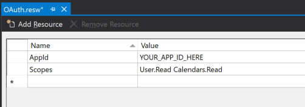

<!-- markdownlint-disable MD002 MD041 -->

В этом упражнении вы будете расширяем приложение из предыдущего упражнения для поддержки проверки подлинности с помощью Azure AD. Это необходимо для получения необходимого маркера доступа OAuth для вызова Microsoft Graph. На этом этапе вы интегрируете элемент управления [аадлогин](https://docs.microsoft.com/dotnet/api/microsoft.toolkit.uwp.ui.controls.graph.aadlogin?view=win-comm-toolkit-dotnet-stable) из [набора инструментов сообщества Windows](https://github.com/Microsoft/WindowsCommunityToolkit) в приложение.

Щелкните правой кнопкой мыши проект **Graph – Tutorial** в обозревателе решений и выберите команду **Добавить _гт_ новый элемент..**.. Выберите **файл Resources (. РеСВ)**, назовите файл `OAuth.resw` и нажмите кнопку **добавить**. Когда новый файл откроется в Visual Studio, создайте два ресурса, как показано ниже.

- **Имя:** `AppId`, **Value:** идентификатор приложения, созданный на портале регистрации приложений
- **Имя:** `Scopes`, **Значение:**`User.Read Calendars.Read`



> [!IMPORTANT]
> Если вы используете систему управления версиями (например, Git), то теперь мы бы не могли исключить `OAuth.resw` файл из системы управления версиями, чтобы избежать случайной утечки идентификатора приложения.

## <a name="configure-the-aadlogin-control"></a>Настройка элемента управления Аадлогин

Начните с добавления кода для считывания значений из файла ресурсов. Откройте `MainPage.xaml.cs` и добавьте приведенный `using` ниже оператор в начало файла.

```cs
using Microsoft.Toolkit.Services.MicrosoftGraph;
```

Замените строку `RootFrame.Navigate(typeof(HomePage));` указанным ниже кодом.

```cs
// Load OAuth settings
var oauthSettings = Windows.ApplicationModel.Resources.ResourceLoader.GetForCurrentView("OAuth");
var appId = oauthSettings.GetString("AppId");
var scopes = oauthSettings.GetString("Scopes");

if (string.IsNullOrEmpty(appId) || string.IsNullOrEmpty(scopes))
{
    Notification.Show("Could not load OAuth Settings from resource file.");
}
else
{
    // Initialize Graph
    MicrosoftGraphService.Instance.AuthenticationModel = MicrosoftGraphEnums.AuthenticationModel.V2;
    MicrosoftGraphService.Instance.Initialize(appId,
        MicrosoftGraphEnums.ServicesToInitialize.UserProfile,
        scopes.Split(' '));

    // Navigate to HomePage.xaml
    RootFrame.Navigate(typeof(HomePage));
}
```

Этот код загружает параметры из `OAuth.resw` и инициализирует глобальный экземпляр объекта `MicrosoftGraphService` с этими значениями.

Теперь добавьте обработчик события для `SignInCompleted` события в `AadLogin` элементе управления. Откройте `MainPage.xaml` файл и замените существующий `<graphControls:AadLogin>` элемент приведенным ниже.

```xml
<graphControls:AadLogin x:Name="Login"
    HorizontalAlignment="Left"
    View="SmallProfilePhotoLeft"
    AllowSignInAsDifferentUser="False"
    SignInCompleted="Login_SignInCompleted"
    SignOutCompleted="Login_SignOutCompleted"
    />
```

Затем добавьте указанные ниже функции в `MainPage` класс в `MainPage.xaml.cs`файле.

```cs
private void Login_SignInCompleted(object sender, Microsoft.Toolkit.Uwp.UI.Controls.Graph.SignInEventArgs e)
{
    // Set the auth state
    SetAuthState(true);
    // Reload the home page
    RootFrame.Navigate(typeof(HomePage));
}

private void Login_SignOutCompleted(object sender, EventArgs e)
{
    // Set the auth state
    SetAuthState(false);
    // Reload the home page
    RootFrame.Navigate(typeof(HomePage));
}
```

Наконец, в обозревателе решений разверните узел **Homepage. XAML** и откройте `HomePage.xaml.cs`его. Добавьте следующий код после `this.InitializeComponent();` строки.

```cs
if ((App.Current as App).IsAuthenticated)
{
    HomePageMessage.Text = "Welcome! Please use the menu to the left to select a view.";
}
```

Перезапустите приложение и щелкните элемент **** управления входом в верхней части приложения. Когда вы вошли в систему, Пользовательский интерфейс должен измениться, чтобы показать, что вы успешно выполнили вход.


> [!NOTE]
> `AadLogin` Элемент управления реализует логику сохранения и обновления маркера доступа. Маркеры хранятся в безопасном хранилище и обновляются по мере необходимости.